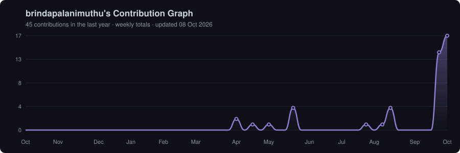

<!-- Put this file in a public repo named exactly: brindapalanimuthu/brindapalanimuthu -->
<!-- Fix the repo links under Featured Works if your repo names differ -->

  

### Machine Learning &nbsp;·&nbsp; LLMs &nbsp;·&nbsp; Reinforcement Learning

Building reliable ML systems, from data to deployment.

---

<h2 align="center">🚀 About Me</h2>

I'm an **ML developer** who enjoys the full ML loop: preparing data, training and evaluating models, and shipping them inside real applications. I'm also a regular at off-campus hackathons, where I turn ideas into working demos.

🏆 **Grand Finalist**, Meta × Hugging Face × Scaler **OpenEnv AI Hackathon 2026**, selected among the top teams for my Bug Triage RL environment project.

🎓 **Ambassador**, GeeksforGeeks **Girls SummerSkillUp**: represented and promoted the program as a campus ambassador.

✍️ **Contributor**, GeeksforGeeks **Girls SummerSkillUp**: actively contributed content and technical resources to the initiative.

---

<h2 align="center">⭐ Featured Works</h2>

<table>
<tr>
<td width="33%" valign="top">

**🐞 [Bug Triage & Escalation Desk](https://github.com/brindapalanimuthu)**

OpenEnv RL environment with a GRPO-trained agent for bug triage and escalation. OpenEnv Hackathon 2026 Grand Finalist.

</td>
<td width="33%" valign="top">

**📄 [FilingLens](https://github.com/brindapalanimuthu)**

Agentic RAG system for analyzing SEC filings (10-K, 10-Q, 8-K) with table, visual and text retrieval plus numeric verification.

</td>
<td width="33%" valign="top">

**📡 [MeshAlert](https://github.com/brindapalanimuthu/MeshAlert)**

Offline-first disaster coordination platform built on a WebRTC mesh, so alerts keep flowing without internet.

</td>
</tr>
</table>

---

<h2 align="center">🤝 Connect</h2>

---

<h2 align="center">💻 Tech Stack</h2>

 

 

---

<h2 align="center">📊 GitHub Stats</h2>

 

---

<h2 align="center">📈 Activity Graph</h2>

